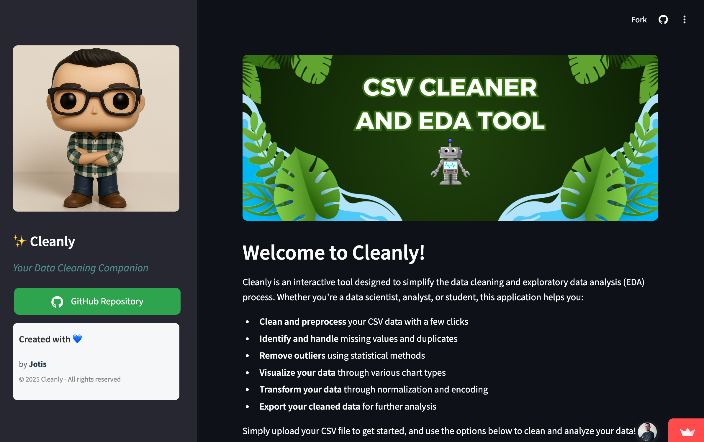

# 🧹 Cleanly: CSV Cleaner and EDA Tool

Cleanly is an interactive Streamlit-based tool that allows you to upload, clean, and analyze CSV files easily. It provides functionalities for data cleaning, outlier removal, data visualization, and exploratory data analysis (EDA).

🚀 **Try it now:** [Launch Cleanly App](https://limpito.streamlit.app/) - No installation required!

## ✨ Features

- 📂 **CSV File Upload**: Upload CSV files for processing.
- 🧹 **Data Cleaning**:
  - 🗑️ Remove duplicate rows.
  - 🩹 Handle missing values (fill with mean or mode based on data type).
- 🚫 **Outlier Removal**:
  - 📊 Based on Z-Score.
  - 📈 Based on Interquartile Range (IQR).
- 📏 **Data Normalization**: Scale numeric values between 0 and 1.
- 🔢 **Categorical Column Encoding**: Convert categorical columns into numeric values.
- ✏️ **Rename and Delete Columns**: Modify or delete specific columns.
- 🔍 **Row Filtering and Sorting**: Filter rows based on specific values and sort data.
- 📊 **Data Visualization**:
  - 📉 Histograms.
  - 📊 Bar charts.
  - 🟢 Scatter plots.
  - 🔗 Correlation matrix with automated insights.
- 📚 **Data Grouping**: Group data by columns and apply aggregation functions like mean, sum, count, etc.
- 🔎 **Enhanced Data Exploration**:
  - 📋 Data type analysis with first value examples
  - 📊 Distribution of column data types visualization
  - 🔍 Automatic outlier detection with statistical measurements
  - 📈 Top outlier columns visualization
- 💾 **Download Processed Data**: Download the cleaned and processed CSV file.

## 🛠️ Requirements

Before running the project, ensure you have the following dependencies installed:

- 🐍 Python 3.7 or higher
- 📦 Streamlit
- 📦 Pandas
- 📦 NumPy
- 📦 Seaborn
- 📦 Matplotlib

## 📝 Usage

### 📂 Upload a CSV File:
Click the "Browse files" button to upload a CSV file from your computer.

### 🔍 Initial Exploration:
View the original data, the number of rows and columns, duplicates, and missing values.

### ⚙️ Select Actions:
Use the dropdown menu to select actions such as cleaning data, removing outliers, normalizing data, etc.

### 📊 Data Visualization:
Generate visualizations such as histograms, bar charts, scatter plots, and the correlation matrix to analyze the data.

### 💾 Download Processed Data:
Once you have finished processing the data, click the download button to save the cleaned CSV file.

---

## 🔍 Detailed Functionalities

### 📊 Data Analysis
- **Descriptive Statistics**: Generate summary statistics (count, mean, std, min, max, quartiles) for numeric columns.
- **Correlation Matrix**: Displays the correlation between numeric columns as a heatmap with automated insights.

### 🧹 Data Cleaning
- **Remove Duplicates**: Identifies and removes duplicate rows in the dataset.
- **Handle Missing Values**:
  - For numeric columns, missing values are filled with the mean.
  - For categorical columns, missing values are filled with the mode.

### 🚫 Outlier Removal
- **Z-Score**: Removes rows where numeric values have a Z-Score greater than a threshold (default: 3).
- **IQR (Interquartile Range)**: Removes rows where numeric values fall outside the IQR range.

### 🔄 Data Transformation
- **Normalize Data**: Scale numeric columns to a range between 0 and 1 for better comparability.
- **Encode Categorical Columns**: Convert text/categorical columns to numeric values for analysis.
- **Rename Columns**: Change column names for better clarity or consistency.
- **Delete Specific Columns**: Remove unnecessary columns from the dataset.

### 🔍 Data Filtering & Sorting
- **Filter Rows**: Filter data based on specific column values with options for different comparison types.
- **Sort Data**: Order the dataset by any column in ascending or descending order.

### 📊 Data Visualization
- **Histograms**: Displays the distribution of numeric values.
- **Bar Charts**: Shows the frequency of categorical values.
- **Scatter Plots**: Visualizes the relationship between two numeric columns.
- **Correlation Matrix**: Displays the correlation between numeric columns as a heatmap.

### 📚 Data Grouping and Aggregation
- Group data by a selected column and apply aggregation functions such as `mean`, `sum`, `count`, `max`, or `min`.

### 💾 Download Processed Data
- Download the processed CSV file with all the applied changes.

---

## 🛠️ Example Workflow

1. 📂 Upload a raw CSV file.
2. 🧹 Select "Clean Data" to remove duplicates and handle missing values.
3. 🚫 Use "Remove Outliers (Z-Score)" to eliminate outliers.
4. 📊 Generate a histogram to analyze the distribution of a numeric column.
5. 💾 Download the cleaned file by clicking "Download Cleaned CSV."

---

## 📸 Screenshots

Below is a preview of Cleanly's interface. The application provides an intuitive dashboard where you can upload your CSV files, clean your data, and perform exploratory data analysis with just a few clicks.

---

## 🤝 Contributions

If you want to contribute to this project, please follow these steps:

1. 🍴 Fork the repository.
2. 🌿 Create a new branch for your feature (`git checkout -b feature/new-feature`).
3. 💻 Make your changes and commit them (`git commit -m "Added new feature"`).
4. 📤 Push your branch (`git push origin feature/new-feature`).
5. 🔁 Open a Pull Request.

---

## 📜 License

This project is licensed under the MIT License. See the [`LICENSE`](./LICENSE) file for more details.